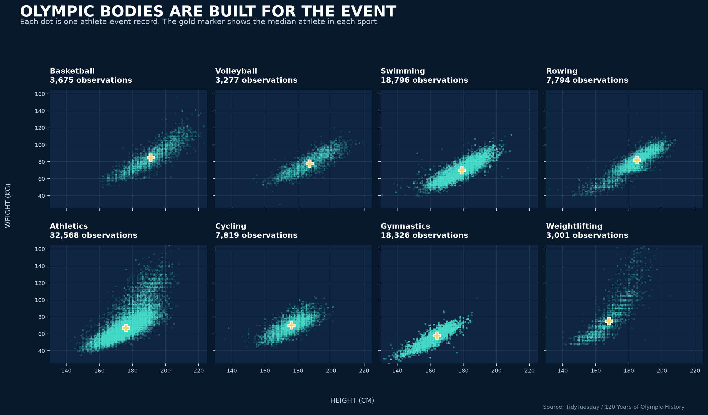

## Project Overview

This project investigates patterns in athletic performance enhancement and doping through anti-doping testing data. Using testing reports from organizations such as the World Anti-Doping Agency (WADA) and the U.S. Anti-Doping Agency (USADA), I plan to analyze how testing volumes and adverse analytical findings differ across sports and how these patterns have evolved over time.

## Key Variables

Key variables of interest for this analysis include:

- **sport**: The athletic discipline (e.g., athletics, cycling, weightlifting, aquatics) to compare detection and testing rates across sports.
- **year**: The testing year, allowing analysis of trends over time in sample volume and positivity rates.
- **test_type**: Whether testing was conducted in-competition or out-of-competition.
- **sample_type**: Biological sample collected (urine vs. blood), which relates to the detection window for different substance classes.
- **adverse_finding**: Indicator of an adverse analytical finding (positive test result), used to calculate positivity rates.

## Exploratory Graphic

The following visualization examines variation in athlete physical profiles across selected major sports based on historical Olympic athlete data (271,116 total records, with 95,256 plotted observations across eight sports), establishing baseline physical demands across sports subject to anti-doping testing.

